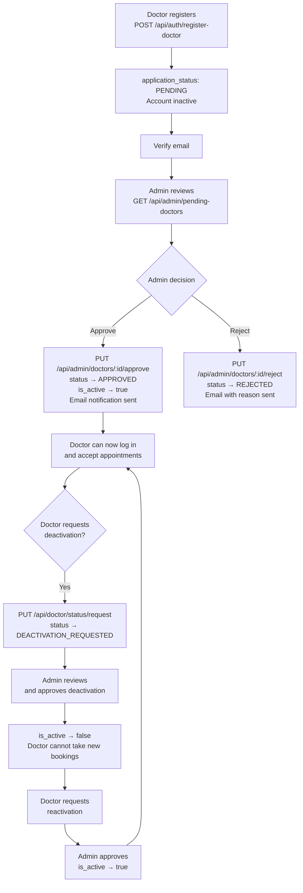
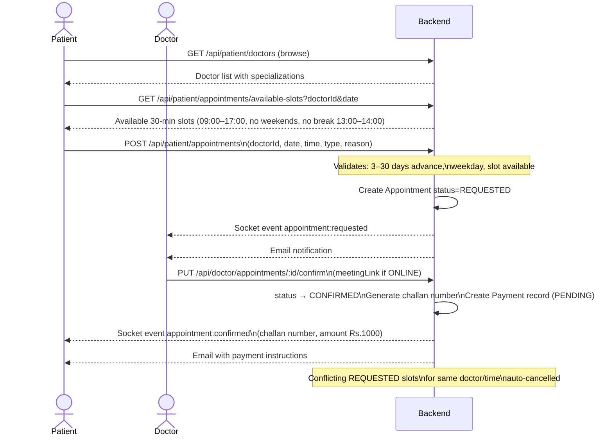
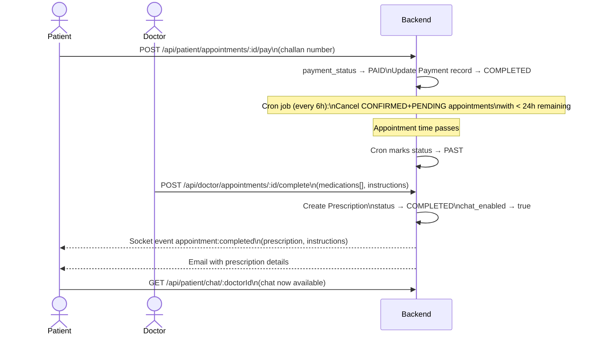
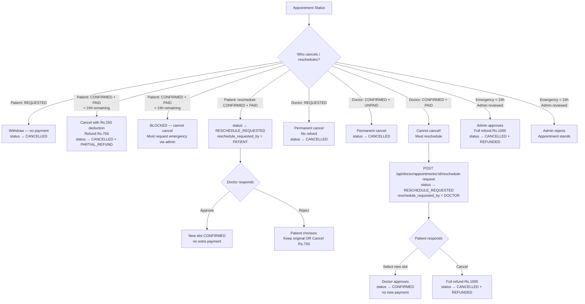
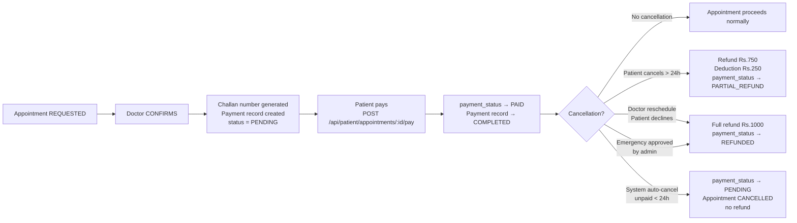
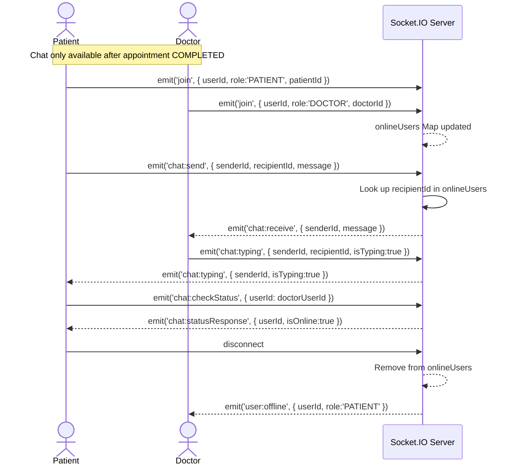
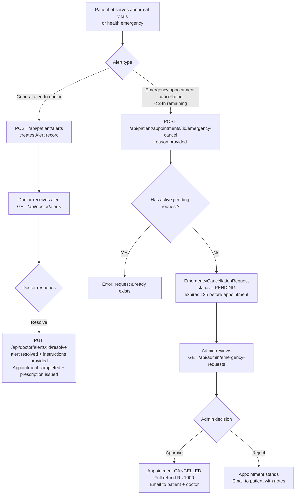
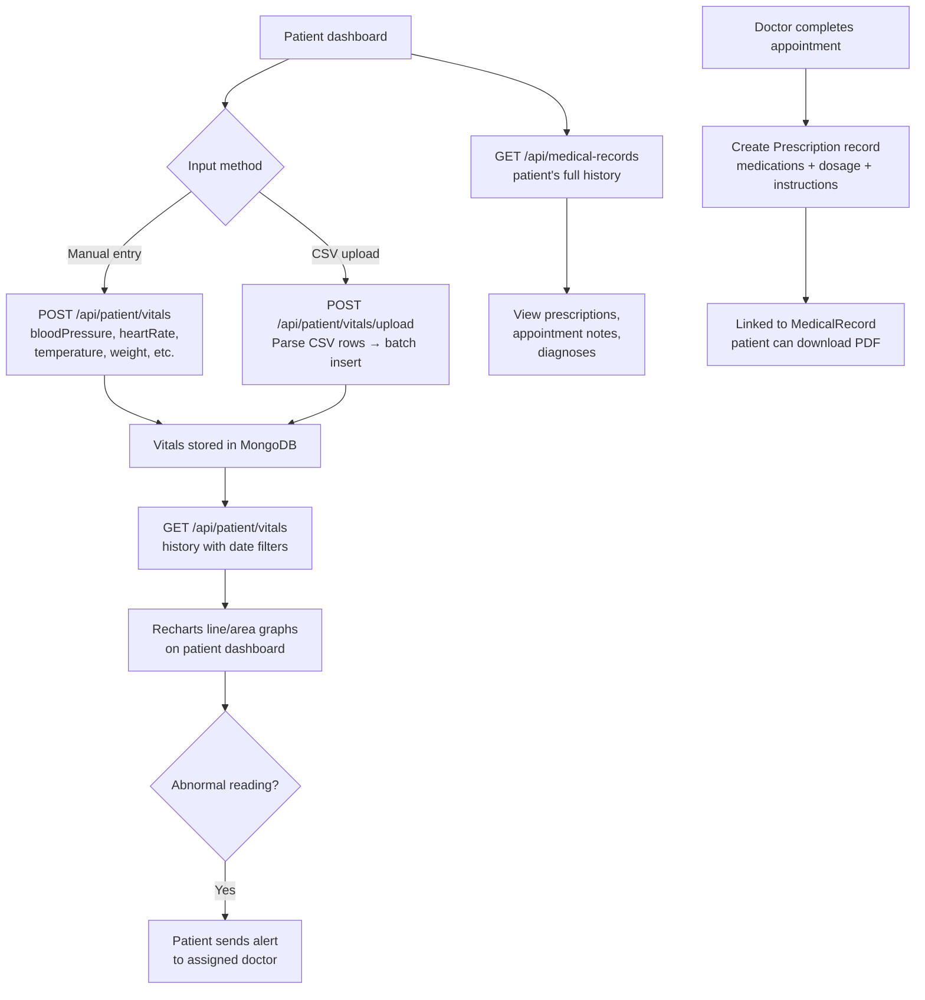
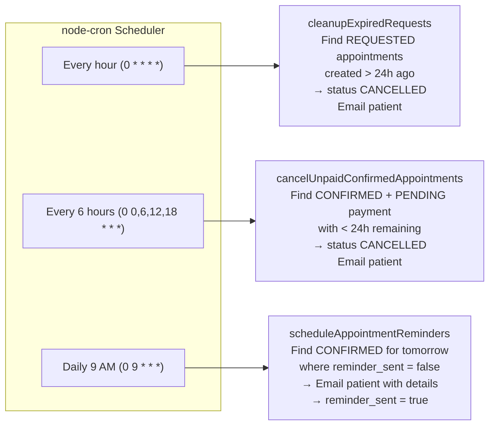

<p align="center">
  
  
  
  
  
  
</p>

<h1 align="center">Healix — Remote Healthcare Management System</h1>

<p align="center">
  A full-stack telemedicine platform enabling virtual consultations, appointment management,<br/>
  real-time patient–doctor communication, and health monitoring.
</p>

---

## Table of Contents

1. [Overview](#overview)
2. [System Architecture](#system-architecture)
3. [Tech Stack](#tech-stack)
4. [Feature Flows & Diagrams](#feature-flows--diagrams)
   - [Authentication Flow](#1-authentication-flow)
   - [Doctor Application & Approval Flow](#2-doctor-application--approval-flow)
   - [Appointment Lifecycle Flow](#3-appointment-lifecycle-flow)
   - [Payment Flow](#4-payment-flow)
   - [Real-Time Communication Flow](#5-real-time-communication-flow)
   - [Emergency Alert Flow](#6-emergency-alert-flow)
   - [Vitals & Medical Records Flow](#7-vitals--medical-records-flow)
   - [Scheduled Jobs Flow](#8-scheduled-jobs-flow)
5. [Database Schema](#database-schema)
6. [Project Structure](#project-structure)
7. [Getting Started](#getting-started)
8. [Environment Variables](#environment-variables)
9. [API Reference](#api-reference)
10. [Security](#security)
11. [Author](#author)

---

## Overview

Healix is a comprehensive telemedicine system with three distinct user roles:

| Role | Key Capabilities |
|------|----------------|
| **Patient** | Book appointments, pay online, track vitals, view medical records, chat with doctors, send emergency alerts |
| **Doctor** | Manage appointments, complete consultations, issue prescriptions, respond to alerts, request reschedule |
| **Admin** | Approve/reject doctors, review emergency cancellations, monitor system logs, manage alerts |

---

## System Architecture

```
┌─────────────────────────────────────────────────────────────────┐
│                        CLIENT LAYER                             │
│   Next.js 14 (App Router)  ·  TypeScript  ·  Tailwind CSS       │
│   Zustand (state)  ·  React Three Fiber (3D UI)  ·  Recharts    │
└──────────────────────────────┬──────────────────────────────────┘
                               │  HTTP (REST) + WebSocket
┌──────────────────────────────▼──────────────────────────────────┐
│                        SERVER LAYER                             │
│   Node.js 18  ·  Express.js  ·  Socket.IO                       │
│   JWT Auth  ·  bcrypt  ·  express-validator  ·  multer          │
│   Nodemailer  ·  PDFKit  ·  Stripe  ·  node-cron               │
└──────────────────────────────┬──────────────────────────────────┘
                               │  Mongoose ODM
┌──────────────────────────────▼──────────────────────────────────┐
│                        DATA LAYER                               │
│   MongoDB  ·  Collections: Users, Patients, Doctors, Admins,    │
│   Appointments, Payments, Prescriptions, MedicalRecords,         │
│   Vitals, Alerts, Messages, Logs, Tokens                        │
└─────────────────────────────────────────────────────────────────┘
```

### Request Flow

```
Browser → Next.js page → apiClient (Axios) → Express router
       → Auth middleware (JWT verify) → Controller
       → Service (business logic) → Mongoose model → MongoDB
       ← JSON response ← Controller ← Service
       (Socket.IO events fire in parallel for real-time updates)
```

---

## Tech Stack

### Frontend
| Technology | Version | Purpose |
|------------|---------|---------|
| Next.js | 14 | React framework (App Router) |
| TypeScript | 5 | Type-safe development |
| Tailwind CSS | 3 | Utility-first styling |
| Framer Motion | 12 | Page & component animations |
| React Three Fiber | 8 | 3D animated backgrounds |
| Socket.IO Client | 4 | Real-time events & chat |
| Zustand | 4 | Global auth state |
| Recharts | 2 | Vitals & dashboard charts |
| Stripe.js | 8 | Payment UI integration |
| Lucide React | 0.294 | Icon library |

### Backend
| Technology | Version | Purpose |
|------------|---------|---------|
| Node.js | 18+ | JavaScript runtime |
| Express.js | 4 | HTTP server & routing |
| MongoDB | 6 | NoSQL database |
| Mongoose | 8 | MongoDB object modeling |
| Socket.IO | 4 | WebSocket server |
| JWT | 9 | Stateless authentication |
| bcryptjs | 2 | Password hashing |
| Nodemailer | 6 | Transactional email |
| Stripe | 20 | Payment processing |
| PDFKit | 0.15 | Prescription PDF generation |
| node-cron | 3 | Scheduled background tasks |
| express-validator | 7 | Request input validation |

---

## Feature Flows & Diagrams

### 1. Authentication Flow

```mermaid
flowchart TD
    A([Visitor]) --> B{Register or Login?}

    %% Registration path
    B -->|Register| C[Fill registration form\nPatient or Doctor]
    C --> D[POST /api/auth/register-patient\nor /register-doctor]
    D --> E[Backend: hash password\ncreate User + Patient/Doctor\ngenerate VerificationToken]
    E --> F[Send verification email]
    F --> G[User clicks link\nGET /api/auth/verify-email?token=...]
    G --> H{Doctor?}
    H -->|Yes| I[Status: PENDING\nAwaits admin approval]
    H -->|No| J[Account active\nRedirect to login]

    %% Login path
    B -->|Login| K[POST /api/auth/login]
    K --> L{Credentials valid?}
    L -->|No| M[401 Invalid credentials]
    L -->|Yes| N[Generate accessToken 7d\n+ refreshToken 30d\nSet HTTP-only cookies]
    N --> O{Role?}
    O -->|PATIENT| P[/patient/dashboard]
    O -->|DOCTOR| Q[/doctor/dashboard]
    O -->|ADMIN| R[/admin/dashboard]

    %% Token refresh
    N --> S[Axios interceptor\nauto-refresh on 401]
    S --> T[POST /api/auth/refresh-token\n→ new accessToken in cookie]

    %% Password reset
    A --> U[Forgot password]
    U --> V[POST /api/auth/forgot-password]
    V --> W[Email with reset link\nPasswordResetToken TTL 1h]
    W --> X[POST /api/auth/reset-password\ntoken + newPassword]
    X --> J
```

**Key security decisions:**
- Access token stored in both HTTP-only cookie and `localStorage` (cookie for SSR, localStorage for client API calls)
- Refresh token is HTTP-only cookie only — never accessible to JavaScript
- Password reset always returns 200 even if email not found (prevents email enumeration)

---

### 2. Doctor Application & Approval Flow



---

### 3. Appointment Lifecycle Flow

This is the most complex flow in the system. Appointments move through these states:

```
REQUESTED → CONFIRMED → PAST → COMPLETED
              ↓             ↓
           RESCHEDULE_REQUESTED
              ↓
           CANCELLED
```

#### 3a. Booking & Confirmation



#### 3b. Payment & Completion



#### 3c. Cancellation & Reschedule Rules



---

### 4. Payment Flow



**Payment amounts:**
| Scenario | Fee |
|----------|-----|
| Appointment fee | Rs. 1,000 |
| Patient cancellation (> 24h) | Rs. 750 refund (Rs. 250 deduction) |
| Doctor-initiated reschedule declined | Rs. 1,000 full refund |
| Emergency cancellation approved | Rs. 1,000 full refund |
| System auto-cancel (unpaid) | Rs. 0 (never paid) |

---

### 5. Real-Time Communication Flow

#### Socket.IO Room Architecture

```
Server rooms:
  user:{userId}       ← every connected user joins this
  doctor:{doctorId}   ← doctors join this
  patient:{patientId} ← patients join this
```

#### Chat Flow



#### Real-Time Event Catalogue

| Event | Direction | Trigger |
|-------|-----------|---------|
| `appointment:requested` | Server → Doctor | Patient books |
| `appointment:confirmed` | Server → Patient | Doctor confirms |
| `appointment:cancelled` | Server → Patient/Doctor | Either party cancels |
| `appointment:completed` | Server → Patient | Doctor marks complete |
| `reschedule:rejected` | Server → Patient | Doctor rejects reschedule |
| `reschedule:doctor_cancelled` | Server → Patient | Doctor cancels reschedule |
| `chat:receive` | Server → Recipient | Message sent |
| `chat:typing` | Server → Recipient | Typing indicator |
| `chat:statusResponse` | Server → Requester | Online status check |
| `doctor:online` / `patient:online` | Server → All | User joins |
| `user:offline` | Server → All | User disconnects |

---

### 6. Emergency Alert Flow



---

### 7. Vitals & Medical Records Flow



---

### 8. Scheduled Jobs Flow



---

## Database Schema

### Collections & Relationships

```
User (base auth)
 ├── Patient (1:1)        → Vitals (1:many)
 ├── Doctor  (1:1)        
 └── Admin   (1:1)

Appointment
 ├── patient_id → Patient
 ├── doctor_id  → Doctor
 └── prescription_id → Prescription (set on COMPLETE)

Payment
 └── appointment_id → Appointment

MedicalRecord
 ├── patient_id → Patient
 └── doctor_id  → Doctor

Message
 ├── sender_id   → User
 └── receiver_id → User

Alert
 ├── patient_id → Patient
 └── doctor_id  → Doctor

EmergencyCancellationRequest
 └── appointment_id → Appointment

DoctorEmergencyRescheduleRequest
 └── appointment_id → Appointment

Log             (system audit trail)
VerificationToken
PasswordResetToken
```

### Appointment Status Reference

| Status | Description |
|--------|-------------|
| `REQUESTED` | Patient submitted, awaiting doctor confirmation |
| `CONFIRMED` | Doctor confirmed, patient must pay |
| `RESCHEDULE_REQUESTED` | Either party requested a new slot |
| `PAST` | Appointment time has passed (auto-set by cron) |
| `COMPLETED` | Doctor marked complete, prescription issued |
| `CANCELLED` | Cancelled by patient, doctor, admin, or system |

---

## Project Structure

```
Healix/
├── backend/
│   └── src/
│       ├── config/
│       │   ├── db.js            # MongoDB connection
│       │   ├── email.js         # Nodemailer transporter
│       │   ├── index.js         # Environment config loader
│       │   ├── jwt.js           # Token generation & verification
│       │   └── socket.js        # Socket.IO server + room management
│       ├── controllers/         # Thin HTTP handlers — delegate to services
│       │   ├── authController.js
│       │   ├── adminController.js
│       │   ├── appointmentController.js
│       │   ├── doctorController.js
│       │   ├── medicalRecordController.js
│       │   └── patientController.js
│       ├── middleware/
│       │   ├── auth.js          # JWT verify + role check
│       │   ├── chatGuard.js     # Blocks chat unless appointment COMPLETED
│       │   ├── errorHandler.js  # Global error formatter
│       │   └── validator.js     # express-validator runner
│       ├── models/              # Mongoose schemas
│       │   ├── User.js          # Base auth document
│       │   ├── Patient.js / Doctor.js / Admin.js
│       │   ├── Appointment.js   # Full lifecycle model
│       │   ├── Payment.js       # Transaction records
│       │   ├── Prescription.js
│       │   ├── MedicalRecord.js
│       │   ├── Vitals.js
│       │   ├── Alert.js
│       │   ├── Message.js
│       │   ├── EmergencyCancellationRequest.js
│       │   ├── DoctorEmergencyRescheduleRequest.js
│       │   ├── Log.js
│       │   ├── VerificationToken.js
│       │   └── PasswordResetToken.js
│       ├── routes/
│       │   ├── index.js         # Mounts all route groups under /api
│       │   ├── authRoutes.js
│       │   ├── adminRoutes.js
│       │   ├── doctorRoutes.js
│       │   ├── patientRoutes.js
│       │   ├── medicalRecordRoutes.js
│       │   ├── chatRoutes.js
│       │   └── logRoutes.js
│       ├── services/            # All business logic lives here
│       │   ├── authService.js
│       │   ├── appointmentService.js  # 2500+ line core service
│       │   ├── adminService.js
│       │   ├── doctorService.js
│       │   ├── patientService.js
│       │   ├── medicalRecordService.js
│       │   ├── logService.js
│       │   ├── schedulerService.js    # node-cron jobs
│       │   ├── stripeService.js
│       │   └── userService.js
│       ├── utils/
│       │   ├── helpers.js
│       │   ├── logger.js        # Writes to Log collection
│       │   └── response.js      # Standardised success/error wrappers
│       ├── validators/
│       │   └── authValidators.js
│       ├── scripts/
│       │   └── initDatabase.js  # Seed admin account
│       └── server.js            # Express app + HTTP server bootstrap
│
├── frontend/
│   └── src/
│       ├── app/                 # Next.js 14 App Router
│       │   ├── page.tsx         # Landing page
│       │   ├── login/
│       │   ├── register/
│       │   ├── verify-email/
│       │   ├── forgot-password/
│       │   ├── reset-password/
│       │   ├── admin/
│       │   │   ├── dashboard/
│       │   │   ├── pending-doctors/
│       │   │   ├── doctors/
│       │   │   ├── patients/
│       │   │   ├── appointments/
│       │   │   ├── emergency-requests/
│       │   │   ├── alerts/
│       │   │   ├── logs/
│       │   │   └── add/
│       │   ├── doctor/
│       │   │   ├── dashboard/
│       │   │   ├── appointments/
│       │   │   ├── patients/
│       │   │   └── alerts/
│       │   └── patient/
│       │       ├── dashboard/
│       │       ├── appointments/
│       │       ├── vitals/
│       │       ├── medical-records/
│       │       ├── alerts/
│       │       ├── profile/
│       │       └── chat/[doctorId]/
│       ├── components/
│       │   ├── canvas/          # React Three Fiber 3D backgrounds
│       │   ├── charts/          # Recharts wrappers
│       │   ├── ProtectedLayout.tsx   # Role-based route guard
│       │   ├── ChatModal.tsx
│       │   ├── Navbar.tsx
│       │   └── ...
│       ├── hooks/
│       │   ├── useApi.ts        # Generic data-fetching hook
│       │   ├── useForm.ts
│       │   ├── usePagination.ts
│       │   └── usePatientAlerts.ts
│       ├── lib/
│       │   ├── apiClient.ts     # Typed Axios wrapper for all endpoints
│       │   ├── authStore.ts     # Zustand auth store
│       │   ├── socket.ts        # Socket.IO client singleton
│       │   └── validation.ts
│       └── types/
│           └── index.ts         # Shared TypeScript interfaces
│
├── .gitignore
└── README.md
```

---

## Getting Started

### Prerequisites

| Requirement | Version |
|-------------|---------|
| Node.js | ≥ 18.0 |
| MongoDB | local or Atlas |
| npm | ≥ 9 |
| Gmail account | for email notifications |
| Stripe account | for payment integration |

### Installation

**1. Clone the repository**
```bash
git clone https://github.com/zainabraza06/Remote_HealthCare_Management_System.git
cd Remote_HealthCare_Management_System
```

**2. Set up backend**
```bash
cd backend
npm install
cp .env.example .env
# Fill in your values in .env
```

**3. Set up frontend**
```bash
cd ../frontend
npm install
cp .env.local.example .env.local
# Fill in your values in .env.local
```

**4. Seed the database**
```bash
cd ../backend
npm run init-db
```

**5. Start development servers**

Terminal 1 — Backend:
```bash
cd backend
npm run dev       # nodemon on port 8080
```

Terminal 2 — Frontend:
```bash
cd frontend
npm run dev       # Next.js on port 3000
```

**6. Access the application**

| Service | URL |
|---------|-----|
| Frontend | http://localhost:3000 |
| Backend API | http://localhost:8080/api |
| Health check | http://localhost:8080/api/health |

---

## Environment Variables

### Backend — `backend/.env`

```env
# Server
PORT=8080
NODE_ENV=development

# MongoDB
MONGODB_URI=mongodb://localhost:27017/healix

# JWT (use strong random secrets in production)
JWT_SECRET=your_jwt_secret_key
JWT_REFRESH_SECRET=your_refresh_secret_key
JWT_EXPIRES_IN=7d
JWT_REFRESH_EXPIRES_IN=30d

# Email (Gmail with App Password)
EMAIL_HOST=smtp.gmail.com
EMAIL_PORT=587
EMAIL_USER=your_email@gmail.com
EMAIL_PASS=your_gmail_app_password

# Stripe
STRIPE_SECRET_KEY=sk_test_your_stripe_secret_key
STRIPE_WEBHOOK_SECRET=whsec_your_webhook_secret

# CORS
FRONTEND_URL=http://localhost:3000
```

### Frontend — `frontend/.env.local`

```env
NEXT_PUBLIC_API_URL=http://localhost:8080/api
NEXT_PUBLIC_SOCKET_URL=http://localhost:8080
NEXT_PUBLIC_APP_NAME=Healix
STRIPE_PUBLISHABLE_KEY=pk_test_your_stripe_publishable_key
```

---

## API Reference

### Authentication — `/api/auth`

| Method | Endpoint | Auth | Description |
|--------|----------|------|-------------|
| POST | `/register-patient` | — | Register new patient |
| POST | `/register-doctor` | — | Submit doctor application |
| POST | `/login` | — | Login (sets HTTP-only cookies) |
| POST | `/logout` | JWT | Clear session cookies |
| POST | `/refresh-token` | Cookie | Issue new access token |
| GET | `/me` | JWT | Get current user profile |
| GET | `/verify-email?token=` | — | Verify email address |
| POST | `/forgot-password` | — | Send password reset email |
| POST | `/reset-password` | — | Reset password with token |
| PUT | `/change-password` | JWT | Change password (logged in) |

### Patient — `/api/patient`

| Method | Endpoint | Description |
|--------|----------|-------------|
| GET | `/dashboard` | Dashboard stats & upcoming appointments |
| GET | `/doctors` | Search available approved doctors |
| GET | `/appointments` | All patient appointments (with filters) |
| POST | `/appointments` | Book new appointment |
| PUT | `/appointments/:id/pay` | Process appointment payment |
| PUT | `/appointments/:id/cancel` | Cancel appointment |
| POST | `/appointments/:id/reschedule` | Request reschedule |
| POST | `/appointments/:id/emergency-cancel` | Request emergency cancellation |
| GET | `/vitals` | Vitals history |
| POST | `/vitals` | Add vitals entry |
| POST | `/vitals/upload` | Batch upload via CSV |
| GET | `/alerts` | View sent alerts |
| POST | `/alerts` | Send emergency alert to doctor |
| GET | `/profile` | Patient profile |
| PUT | `/profile` | Update profile |

### Doctor — `/api/doctor`

| Method | Endpoint | Description |
|--------|----------|-------------|
| GET | `/dashboard` | Dashboard stats |
| GET | `/appointments` | All doctor appointments |
| PUT | `/appointments/:id/confirm` | Confirm appointment (+ meeting link for online) |
| PUT | `/appointments/:id/reject` | Reject appointment request |
| POST | `/appointments/:id/complete` | Complete with prescription |
| PUT | `/appointments/:id/reschedule-request` | Request patient reschedule |
| PUT | `/appointments/:id/approve-reschedule` | Approve patient's reschedule |
| PUT | `/appointments/:id/reject-reschedule` | Reject patient's reschedule |
| GET | `/patients` | Assigned patients list |
| GET | `/alerts` | Incoming patient alerts |
| PUT | `/alerts/:id/resolve` | Resolve alert |
| GET | `/profile` | Doctor profile |
| PUT | `/status/request` | Request activation/deactivation |

### Admin — `/api/admin`

| Method | Endpoint | Description |
|--------|----------|-------------|
| GET | `/dashboard` | System-wide statistics |
| GET | `/pending-doctors` | Doctors awaiting review |
| PUT | `/doctors/:id/approve` | Approve doctor application |
| PUT | `/doctors/:id/reject` | Reject doctor application |
| GET | `/doctors` | All doctors (with filters) |
| GET | `/patients` | All patients |
| GET | `/appointments` | All appointments |
| GET | `/emergency-requests` | Pending emergency cancellations |
| PUT | `/emergency-requests/:id/review` | Approve or reject |
| GET | `/alerts` | System alerts |
| POST | `/alerts` | Create system alert |
| DELETE | `/alerts/:id` | Delete alert |
| GET | `/logs` | System activity logs |

### Chat — `/api/chat`

| Method | Endpoint | Description |
|--------|----------|-------------|
| GET | `/patient/:doctorId/history` | Chat history (patient view) |
| GET | `/doctor/:patientId/history` | Chat history (doctor view) |
| POST | `/send` | Persist a chat message |

### Medical Records — `/api/medical-records`

| Method | Endpoint | Description |
|--------|----------|-------------|
| GET | `/` | Patient's full medical history |
| GET | `/:id` | Single record detail |
| GET | `/:id/prescription/pdf` | Download prescription PDF |

---

## Security

| Feature | Implementation |
|---------|---------------|
| Password hashing | bcryptjs, 10 salt rounds |
| Access tokens | JWT, 7-day expiry, HTTP-only cookie + Authorization header |
| Refresh tokens | JWT, 30-day expiry, HTTP-only cookie only |
| CORS | Restricted to configured origins |
| Input validation | express-validator on all mutation endpoints |
| Role-based access | `auth.js` middleware enforces role per route group |
| Chat guard | `chatGuard.js` blocks chat unless appointment is COMPLETED |
| Email enumeration | Password reset always returns 200 regardless of email existence |
| Secret env vars | `.env` / `.env.local` excluded from version control |

---

## Author

**Zainab Raza Malik**
- GitHub: [@zainabraza06](https://github.com/zainabraza06)
- LinkedIn: [Zainab Raza Malik](https://www.linkedin.com/in/zainab-raza-malik-9b9a42219)

---

<p align="center">Made with care for better healthcare accessibility</p>
